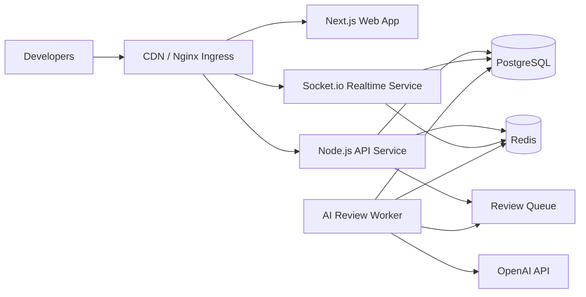
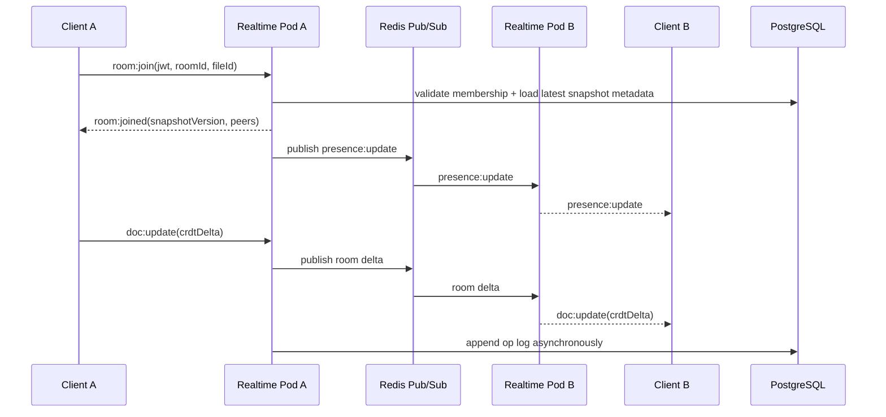

# CodePulse - Production-Grade System Design

## 0. Guiding Principles

This design assumes a strong college-level engineer building a startup-quality system without pretending to be Google on day one.

Practical choices:

- Start as a modular monorepo, not a microservice maze.
- Use a proven CRDT library for real-time editing instead of implementing OT from scratch.
- Keep stateless app services on Kubernetes, but prefer managed PostgreSQL and Redis in production.
- Use WebSockets only for real-time collaboration and review streaming; keep standard CRUD over HTTP.
- Persist snapshots and review history durably, but keep presence and transient room state ephemeral.

Recommended architecture progression:

1. MVP: `web + api + postgres`
2. Real-time: add `realtime + redis`
3. AI reviews: add `worker + queue`
4. Scale: add autoscaling, observability, backpressure controls
5. Production: harden auth, secrets, backups, CI/CD, monitoring

## 1. Full System Architecture

### 1.1 High-Level Architecture



### 1.2 Frontend Architecture

Primary frontend responsibilities:

- Render the editor UI, file tree, review panel, version history, and collaborator presence.
- Maintain local editor state and CRDT document bindings.
- Handle optimistic UI updates for cursor movement, typing indicators, and comments.
- Use HTTP for durable operations like auth, workspace CRUD, file metadata, history, and review requests.
- Use WebSockets for real-time document updates, presence, cursor sync, and streamed AI review events.

Suggested frontend stack shape:

- `Next.js App Router` for routing and SSR where helpful.
- `Monaco Editor` for code editing.
- `TanStack Query` for HTTP data fetching and cache control.
- `Zustand` or lightweight client stores for ephemeral UI state.
- `Yjs` document binding on the client for CRDT sync.
- `Socket.io-client` for realtime transport.

Frontend modules:

- `app/`: routes, layouts, auth pages, workspace pages
- `features/editor/`: Monaco setup, CRDT binding, cursors, presence
- `features/review/`: AI findings, inline suggestions, apply-fix UI
- `features/history/`: snapshots, diffs, restore actions
- `lib/api/`: typed API client
- `lib/socket/`: connection manager, reconnect logic, auth handshake
- `lib/auth/`: token refresh and session guards

### 1.3 Backend Architecture

Keep the backend split by responsibility, not vanity:

- `web`: Next.js application
- `api`: HTTP service for auth, projects, files, reviews, history
- `realtime`: Socket.io gateway for live collaboration and presence
- `worker`: async processing for AI reviews, snapshot compaction, analytics

Core backend responsibilities:

- `api`
  - user auth
  - workspace and file CRUD
  - version history reads
  - review creation and retrieval
  - authorization checks

- `realtime`
  - socket authentication
  - room join/leave
  - CRDT update relay
  - cursor and presence fanout
  - reconnect/session recovery

- `worker`
  - queue-driven AI review execution
  - code chunking and prompt assembly
  - structured finding extraction
  - periodic snapshot compaction
  - stale room cleanup jobs

### 1.4 WebSocket Event Flow

Use versioned event names so the protocol can evolve cleanly.

Core events:

- `room:join`
- `room:joined`
- `room:leave`
- `presence:update`
- `cursor:update`
- `doc:update`
- `doc:sync-request`
- `doc:sync-response`
- `review:request`
- `review:status`
- `review:stream`
- `review:completed`
- `review:failed`

Example collaboration flow:



### 1.5 Redis Pub/Sub Communication

Use Redis for ephemeral fanout, not as your source of truth.

Recommended channel layout:

- `room:{roomId}:doc`
- `room:{roomId}:presence`
- `room:{roomId}:cursor`
- `room:{roomId}:review`
- `system:snapshot-jobs`
- `system:cleanup-jobs`

Recommended usage:

- Redis Pub/Sub for low-latency fanout across realtime pods.
- Redis Streams or a queue abstraction for durable async jobs like AI reviews.
- Redis TTL keys for transient presence state and reconnect windows.

Important tradeoff:

- Pub/Sub is fast but lossy. If a consumer is down, the message is gone.
- That is acceptable for cursors and presence.
- It is not acceptable for version history or AI review jobs.
- Durable workflows must also be persisted to PostgreSQL or a queue.

### 1.6 Database Schema Design

Use PostgreSQL for durable business state and historical records:

- user accounts
- workspace membership
- file metadata
- snapshots and version history
- AI review jobs and findings
- audit and collaboration events

Design rule:

- Store frequently changing transient state in Redis.
- Store authoritative state changes and recoverable history in PostgreSQL.

### 1.7 Kubernetes Deployment Structure

Recommended production deployment:

- `web` Deployment
- `api` Deployment
- `realtime` Deployment
- `worker` Deployment
- `ingress-nginx` Ingress Controller
- `cert-manager` for TLS
- `prometheus` and `grafana`

Prefer external managed services for:

- PostgreSQL
- Redis
- container registry
- object storage if you later export snapshots or archives

Why this is realistic:

- Running your own PostgreSQL and Redis inside the same student-built K8s cluster adds operational failure modes faster than it adds learning value.

### 1.8 API Gateway and Scaling Strategy

Use `Nginx Ingress` as the first gateway layer.

Routing:

- `/` -> `web`
- `/api/*` -> `api`
- `/socket.io/*` -> `realtime`

Scaling strategy:

- `web` scales on CPU and request rate
- `api` scales on CPU and latency
- `realtime` scales on active connections and event throughput
- `worker` scales on queue depth

Notes:

- If you allow Socket.io long-polling fallback, sticky sessions simplify connection upgrades.
- If you enforce WebSocket transport in production, sticky sessions become less important.
- Start single-region. Cross-region collaborative editing adds meaningful complexity in latency and ordering.

## 2. Step-by-Step Development Roadmap

## Phase 1: MVP

### Features

- email/password auth
- workspace creation
- file create/read/update
- Monaco editor for single-user editing
- explicit save
- basic version snapshots on save
- manual "Review with AI" button returning a summary

### Folder Structure

```text
apps/
  web/
  api/
packages/
  types/
  db/
  auth/
```

### APIs

- `POST /api/auth/register`
- `POST /api/auth/login`
- `POST /api/auth/refresh`
- `POST /api/workspaces`
- `GET /api/workspaces`
- `POST /api/files`
- `GET /api/files/:fileId`
- `PUT /api/files/:fileId/content`
- `POST /api/files/:fileId/reviews`
- `GET /api/files/:fileId/history`

### Database Tables

- `users`
- `refresh_tokens`
- `workspaces`
- `workspace_members`
- `files`
- `document_snapshots`
- `ai_review_jobs`
- `ai_review_findings`

### Key Engineering Challenges

- drawing the line between editor autosave and explicit versioning
- building typed APIs cleanly
- preventing auth/session bugs
- keeping file saves and review requests idempotent

## Phase 2: Collaboration Engine

### Features

- multi-user room join/leave
- real-time editing
- cursor synchronization
- collaborator presence
- reconnect and state resync
- periodic background snapshotting

### Folder Structure

```text
apps/
  web/
  api/
  realtime/
packages/
  types/
  db/
  auth/
  collab/
```

### APIs

HTTP:

- `POST /api/rooms`
- `GET /api/rooms/:roomId`
- `GET /api/files/:fileId/collaborators`

Socket:

- `room:join`
- `room:leave`
- `doc:update`
- `cursor:update`
- `presence:update`
- `doc:sync-request`
- `doc:sync-response`

### Database Tables

- `collaboration_rooms`
- `room_sessions`
- `document_operations`
- `collaboration_events`

### Key Engineering Challenges

- choosing CRDT data model and wire format
- recovering from dropped socket connections without corrupting document state
- keeping room authorization cheap and correct
- preventing noisy presence updates from overwhelming the system

## Phase 3: AI Review System

### Features

- async AI review jobs
- diff-aware prompt building
- inline findings mapped to line ranges
- code smell and bug-risk classification
- streamed review progress
- user-accepted suggestion tracking

### Folder Structure

```text
apps/
  web/
  api/
  realtime/
  worker/
packages/
  ai-review/
  collab/
  db/
  types/
```

### APIs

- `POST /api/reviews`
- `GET /api/reviews/:reviewId`
- `GET /api/files/:fileId/reviews`
- `POST /api/reviews/:reviewId/apply-suggestion`

Socket:

- `review:request`
- `review:status`
- `review:stream`
- `review:completed`
- `review:failed`

### Database Tables

- `ai_review_jobs`
- `ai_review_findings`
- `ai_review_feedback`

### Key Engineering Challenges

- token cost control
- mapping natural language findings back to exact line ranges
- handling large files without low-quality reviews
- giving useful feedback without pretending the model is always right

## Phase 4: Scalability Improvements

### Features

- Redis-backed multi-pod realtime fanout
- queue-based review workers
- rate limiting
- snapshot compaction
- backpressure handling
- metrics and tracing

### Folder Structure

```text
apps/
  api/
  realtime/
  worker/
packages/
  observability/
  rate-limit/
  collab/
  ai-review/
```

### APIs

- `GET /api/health`
- `GET /api/ready`
- `GET /api/metrics`
- admin endpoints for job health and room diagnostics

### Database Tables

- `rate_limit_counters` if you choose SQL-backed fallbacks
- `system_audit_logs`
- `snapshot_compaction_runs`

### Key Engineering Challenges

- hot rooms with many editors
- Redis channel fanout overhead
- queue buildup during review spikes
- keeping database write amplification under control

## Phase 5: Production Deployment

### Features

- Dockerized services
- Kubernetes deployment
- CI/CD pipeline
- TLS
- autoscaling
- dashboards and alerts
- backups and disaster recovery

### Folder Structure

```text
infra/
  docker/
  k8s/
.github/
  workflows/
```

### APIs

- no major new product APIs
- operational endpoints only

### Database Tables

- no new core product tables required
- possibly `deployment_audit_logs` if desired

### Key Engineering Challenges

- safe secret management
- zero-downtime deployments
- schema migration strategy
- alert fatigue and noisy dashboards

## 3. Realistic Resume Project Description

### ATS-Optimized Resume Bullets

- Built a collaborative browser-based code editor using `Next.js`, `TypeScript`, `Node.js`, and `Socket.io`, enabling multi-user real-time editing with persistent file history.
- Designed a real-time synchronization layer using `Redis Pub/Sub` and CRDT-based document updates to support low-latency collaboration across multiple backend instances.
- Implemented an AI-assisted review pipeline using the `OpenAI API` to generate inline code findings, refactoring suggestions, and bug-risk summaries for edited files.
- Modeled durable collaboration data in `PostgreSQL`, including workspaces, files, version snapshots, review history, and editor session metadata.
- Containerized application services with `Docker` and planned Kubernetes-based deployment with ingress routing, autoscaling, and metrics collection for production readiness.

### LinkedIn Project Section

CodePulse is a real-time collaborative code editor inspired by Google Docs for software teams. I designed it as a full-stack system using Next.js, Node.js, Socket.io, Redis, PostgreSQL, and the OpenAI API. The platform supports concurrent editing, presence tracking, version history, and AI-generated code review suggestions. The project focused on practical distributed systems tradeoffs such as state synchronization, horizontal scaling for WebSocket servers, and durable persistence of collaboration history.

### Portfolio Description

CodePulse is a production-oriented collaborative coding platform where multiple users can edit the same file in real time, see each other's cursors, request AI-assisted reviews, and restore earlier versions. The system is designed around a dedicated realtime service, Redis-backed event fanout, PostgreSQL persistence, and an async review worker that streams findings back into the editor. The project is intentionally scoped like an early-stage startup product: technically ambitious, but built with maintainability and operational realism in mind.

### GitHub README Introduction

CodePulse is a real-time collaborative code editor with AI-powered review workflows. It combines a Next.js frontend, Node.js backend services, Socket.io for live editing, Redis Pub/Sub for cross-instance collaboration, PostgreSQL for durable version history, and an OpenAI-powered review pipeline for inline code suggestions. The goal of the project is to explore how collaborative developer tools are built in practice, with an emphasis on clean architecture, scalability, and realistic production engineering tradeoffs.

## 4. Real-Time Collaboration Design

### OT vs CRDT

| Topic | OT | CRDT |
| --- | --- | --- |
| Core idea | Transform conflicting operations against each other | Merge state using conflict-free data types |
| Server role | Usually central and order-aware | Can be more peer-friendly and eventually consistent |
| Implementation difficulty | High if built from scratch | High in theory, lower in practice with libraries like Yjs |
| Offline/reconnect support | Harder | Better |
| Operational visibility | Easier to reason about ordered ops | More opaque binary updates |
| Best fit here | Good for a custom learning project | Better for a practical production-grade student project |

### Which One Is Better for CodePulse?

Recommendation: use `CRDT`, specifically a mature library such as `Yjs`, with Socket.io carrying encoded updates.

Why:

- You want a buildable system, not a semester-long distributed algorithms implementation.
- CRDT libraries already solve many edge cases around merge safety and reconnect.
- Session recovery and late-join sync are cleaner.
- You can scale the backend as a relay/persistence layer rather than a complex transform engine.

When OT would still make sense:

- if your goal is specifically to learn text transformation internals
- if you need strict server-controlled ordering semantics
- if your interview story is "I implemented the algorithm myself"

### Conflict Resolution Strategy

Recommended approach:

- Client applies edits locally through the CRDT document.
- Encoded update is sent to the realtime service.
- Realtime service rebroadcasts the update through Redis and to local room members.
- Peers merge updates via CRDT rules.
- Server periodically persists merged document snapshots and update logs.

Practical policy:

- Use CRDT merge semantics for text.
- Use last-write-wins only for truly ephemeral metadata like cursor color or UI panel state.
- Never use last-write-wins for document content.

### Cursor Synchronization

Store cursors separately from the document model.

Why:

- cursor movement is high frequency and ephemeral
- cursor positions do not need durable storage
- mixing cursors into the core document state increases noise and cost

Recommended cursor payload:

```json
{
  "userId": "u_123",
  "fileId": "f_123",
  "anchor": 120,
  "head": 128,
  "color": "#2F7DFF",
  "updatedAt": "2026-05-23T12:00:00Z"
}
```

### Presence Tracking

Presence should live primarily in Redis with TTL:

- `user joined room`
- `last heartbeat`
- `active file`
- `typing`
- `cursor state`

Presence lifecycle:

1. client joins room
2. server writes ephemeral presence record with TTL
3. client sends heartbeat every 15 to 30 seconds
4. server republishes lightweight presence events on change
5. stale sessions expire automatically if heartbeats stop

### Session Recovery

Session recovery should tolerate dropped Wi-Fi without forcing full document loss.

Recommended flow:

1. client reconnects with `roomId`, `fileId`, `lastKnownSnapshotVersion`, and `lastAppliedUpdateId`
2. server checks whether recent updates are still available
3. if yes, replay missed updates
4. if no, send latest compacted snapshot and resume from there

Recovery window:

- keep recent update logs in Redis for fast replay
- keep authoritative snapshots in PostgreSQL
- compact updates every `N` operations or `T` seconds

## 5. AI Code Review Engine

### GPT-4 Review Pipeline

Treat the AI reviewer as an async subsystem, not as an inline request-response function.

Pipeline:

1. user triggers review manually or after a debounce window
2. API creates `ai_review_job`
3. worker loads current file content plus metadata
4. worker computes diff against the last stable snapshot
5. worker runs lightweight static checks first
6. worker chunks the code if needed
7. worker calls a GPT-4-class OpenAI model with a structured response schema
8. worker normalizes findings into line-based records
9. worker stores results in PostgreSQL
10. worker streams status and partial summaries back over Socket.io

### Inline Suggestions

Each finding should map to:

- file id
- start line
- end line
- severity
- category
- explanation
- suggested patch or replacement snippet

UI behavior:

- show findings in a side panel
- highlight line ranges inline
- let users accept, dismiss, or comment on suggestions
- record accepted suggestions to improve future prompt examples

### Bug Detection

The AI layer should not be the only reviewer.

Use a hybrid approach:

- TypeScript compiler diagnostics
- ESLint rules
- optional AST-based checks for obvious patterns
- AI model for higher-order reasoning, edge cases, and readability issues

This reduces hallucinated "bugs" and gives the AI better context.

### Complexity Analysis

Measure complexity with deterministic tools before asking the model:

- function length
- nesting depth
- cyclomatic complexity
- repeated code markers
- broad `any` usage or weak typing indicators

Then ask the model to explain why a complex area is risky, not merely to rediscover complexity from scratch.

### Refactoring Recommendations

Good AI refactoring output is specific and constrained:

- extract function
- split conditional logic
- reduce duplicate branches
- improve naming
- isolate side effects
- simplify async flow

Bad AI refactoring output is broad and generic:

- "improve maintainability"
- "use better abstractions"

### Prompt Engineering Strategy

Use layered prompts:

- system prompt: coding reviewer persona and output format
- developer prompt: project rules, severity rubric, style constraints
- user prompt: diff, relevant file snippet, language, requested focus

Recommended review rubric:

- correctness
- concurrency hazards
- performance
- readability
- security
- testability

Force structured output:

```json
{
  "summary": "string",
  "findings": [
    {
      "title": "string",
      "severity": "low|medium|high",
      "category": "bug|performance|security|readability|refactor",
      "startLine": 0,
      "endLine": 0,
      "explanation": "string",
      "suggestion": "string"
    }
  ]
}
```

### Token Optimization

Token control matters because source files get large quickly.

Best practices:

- send diffs, not the whole project
- include only the surrounding function or class for changed lines
- cap review size by file length
- chunk by syntax boundaries, not raw character count
- summarize unchanged context before sending it
- cache static repository rules separately in the application, not inside every prompt

Practical rule:

- full-file review for files under 300 to 500 LOC
- diff-plus-context review for larger files
- review by symbol or function for very large files

### Streaming Responses

Recommended streaming model:

- stream job status and partial summaries over WebSocket
- persist only finalized structured findings
- optionally stream token text only to the requesting user
- broadcast final review results to all collaborators in the room

Why:

- partial tokens are useful for responsiveness
- partial tokens are noisy as shared collaboration artifacts

## 6. Backend Engineering

### Fast and Scalable WebSocket Architecture

Design the realtime tier as a dedicated service:

- authenticate once at handshake
- join users to `room:{roomId}` namespaces
- keep only ephemeral room membership and recent state in memory
- offload fanout to Redis adapter for multi-pod broadcast
- persist durable updates asynchronously

Performance principles:

- avoid synchronous PostgreSQL writes on every keystroke
- batch persistence of updates
- debounce presence events
- compress large document update payloads
- keep per-room memory bounded

### Redis Pub/Sub Implementation Strategy

At the realtime layer:

- publish document deltas per room
- publish cursor and presence updates separately
- use different channels to avoid coupling high-frequency cursor traffic with document updates
- keep payloads small and typed

At the worker layer:

- do not rely on Pub/Sub for review jobs
- enqueue durable jobs instead

### Rate Limiting

Use layered rate limits:

- auth routes by IP
- review creation by user and workspace
- file creation/update by user
- socket events by user and room

Examples:

- login: 5 to 10 attempts per 15 minutes per IP
- review requests: 10 per hour per user for free-tier behavior
- socket event flood guard: disconnect or throttle clients sending abusive event rates

Implementation:

- Redis token bucket or sliding window
- coarse limits at ingress
- finer semantic limits in the API/realtime services

### Authentication

Recommended auth model:

- short-lived access JWT
- long-lived refresh token stored hashed in PostgreSQL
- access token delivered in secure, httpOnly cookie
- socket handshake validates JWT and room membership

JWT payload should stay small:

- `sub`
- `email`
- `workspaceRoles` only if coarse-grained
- `sessionId`

Do not put large permission graphs inside JWTs.

### Room Management

Room model:

- workspace contains many files
- each file can have one active collaboration room per branch or working copy
- room membership is derived from workspace/file authorization

Room operations:

- create if missing on first join
- mark active while users are connected
- expire when idle
- attach last snapshot version and recovery cursor

### Session Persistence

Persist:

- joins/leaves for audit if useful
- snapshots at intervals
- important review events
- explicit saves and restores

Do not persist at high frequency:

- raw cursor movement
- every heartbeat
- every intermediate token streamed from the model

### Version History Design

Use a two-layer history model:

- append-only operation log for recent recovery
- periodic snapshots for durable restores

Suggested policy:

- snapshot every 100 operations or every 5 seconds during active edits
- always snapshot on explicit save, restore, or review trigger
- compact old operation logs after snapshot creation

## 7. Database Design

### Core PostgreSQL Schema

```sql
create table users (
  id uuid primary key,
  email text unique not null,
  password_hash text not null,
  display_name text not null,
  avatar_url text,
  created_at timestamptz not null default now()
);

create table refresh_tokens (
  id uuid primary key,
  user_id uuid not null references users(id) on delete cascade,
  token_hash text not null,
  expires_at timestamptz not null,
  created_at timestamptz not null default now(),
  revoked_at timestamptz
);

create table workspaces (
  id uuid primary key,
  name text not null,
  owner_user_id uuid not null references users(id),
  created_at timestamptz not null default now()
);

create table workspace_members (
  workspace_id uuid not null references workspaces(id) on delete cascade,
  user_id uuid not null references users(id) on delete cascade,
  role text not null check (role in ('owner', 'editor', 'viewer')),
  joined_at timestamptz not null default now(),
  primary key (workspace_id, user_id)
);

create table files (
  id uuid primary key,
  workspace_id uuid not null references workspaces(id) on delete cascade,
  path text not null,
  language text not null,
  created_by uuid not null references users(id),
  created_at timestamptz not null default now(),
  updated_at timestamptz not null default now(),
  unique (workspace_id, path)
);

create table collaboration_rooms (
  id uuid primary key,
  file_id uuid not null references files(id) on delete cascade,
  branch_name text not null default 'main',
  status text not null check (status in ('active', 'idle', 'archived')),
  latest_snapshot_id uuid,
  created_at timestamptz not null default now(),
  updated_at timestamptz not null default now(),
  unique (file_id, branch_name)
);

create table document_snapshots (
  id uuid primary key,
  room_id uuid not null references collaboration_rooms(id) on delete cascade,
  file_id uuid not null references files(id) on delete cascade,
  version_no bigint not null,
  text_content text not null,
  crdt_state bytea,
  created_by uuid references users(id),
  reason text not null check (reason in ('autosave', 'manual_save', 'review', 'restore', 'compaction')),
  created_at timestamptz not null default now(),
  unique (room_id, version_no)
);

create table document_operations (
  id uuid primary key,
  room_id uuid not null references collaboration_rooms(id) on delete cascade,
  file_id uuid not null references files(id) on delete cascade,
  actor_user_id uuid not null references users(id),
  seq_no bigint not null,
  base_version_no bigint not null,
  op_kind text not null,
  op_payload jsonb,
  crdt_update bytea,
  created_at timestamptz not null default now(),
  unique (room_id, seq_no)
);

create table ai_review_jobs (
  id uuid primary key,
  file_id uuid not null references files(id) on delete cascade,
  snapshot_id uuid not null references document_snapshots(id) on delete cascade,
  triggered_by uuid not null references users(id),
  status text not null check (status in ('queued', 'running', 'completed', 'failed')),
  model_name text not null,
  input_tokens integer,
  output_tokens integer,
  latency_ms integer,
  summary text,
  error_message text,
  created_at timestamptz not null default now(),
  completed_at timestamptz
);

create table ai_review_findings (
  id uuid primary key,
  review_job_id uuid not null references ai_review_jobs(id) on delete cascade,
  severity text not null check (severity in ('low', 'medium', 'high')),
  category text not null,
  title text not null,
  explanation text not null,
  suggestion text,
  start_line integer,
  end_line integer,
  confidence numeric(3,2),
  accepted_by uuid references users(id),
  accepted_at timestamptz
);

create table collaboration_events (
  id uuid primary key,
  room_id uuid references collaboration_rooms(id) on delete cascade,
  file_id uuid references files(id) on delete cascade,
  user_id uuid references users(id),
  event_type text not null,
  event_payload jsonb,
  created_at timestamptz not null default now()
);
```

### Table Intent

- `users`, `refresh_tokens`: auth and session lifecycle
- `workspaces`, `workspace_members`: authorization boundary
- `files`: durable code assets
- `collaboration_rooms`: active editing scope
- `document_snapshots`: durable restore points
- `document_operations`: recent granular change history
- `ai_review_jobs`, `ai_review_findings`: AI review lifecycle
- `collaboration_events`: coarse analytics and auditing

### Indexing Recommendations

- index `files(workspace_id, updated_at desc)`
- index `document_snapshots(room_id, version_no desc)`
- index `document_operations(room_id, seq_no desc)`
- index `ai_review_jobs(file_id, created_at desc)`
- index `collaboration_events(room_id, created_at desc)`

## 8. DevOps + Deployment

### Docker Setup

Use multi-stage Dockerfiles:

- install dependencies
- build TypeScript
- copy only runtime artifacts into slim production image

Suggested images:

- `web`: `next start`
- `api`: compiled Node app
- `realtime`: compiled Node app
- `worker`: compiled Node app

Local development:

- use `docker-compose` for `postgres`, `redis`, and maybe app services
- keep local setup simple enough that contributors can boot it quickly

### Kubernetes Deployment

Recommended cluster layout:

- namespace per environment: `staging`, `production`
- Deployments for stateless services
- Services for internal routing
- Ingress for public routing
- ConfigMaps for non-secret config
- Secrets or external secret provider for credentials

### Horizontal Pod Autoscaling

HPA signals:

- `web`: CPU + request rate
- `api`: CPU + p95 latency
- `realtime`: active connections + event throughput if exposed as custom metrics
- `worker`: queue depth

Start simple:

- min 2 pods for `api` and `realtime`
- scale `worker` independently from user traffic

### Nginx Ingress

Use ingress for:

- TLS termination
- path-based routing
- websocket upgrade support
- coarse rate limiting

Keep it boring. You do not need a separate service mesh for this project.

### SSL Setup

Recommended:

- `cert-manager`
- `Let's Encrypt`
- auto-renewing certificates

### CI/CD with GitHub Actions

Pipeline stages:

1. install dependencies
2. lint
3. type-check
4. unit tests
5. build images
6. push images to registry
7. deploy to staging
8. run smoke tests
9. manual approval to production

Important deployment rules:

- migrations run before app rollout
- health checks gate traffic
- rollback should use last known good image tag

### Monitoring with Prometheus + Grafana

Track:

- HTTP latency and error rates
- websocket connection count
- room count and per-room event rate
- Redis memory and pub/sub throughput
- PostgreSQL latency and connection pool usage
- AI review queue depth, latency, token usage, failure rate

Useful dashboards:

- user traffic
- realtime health
- database health
- AI review cost and latency

## 9. Security Design

### JWT Authentication

Use short-lived access tokens and rotating refresh tokens.

Recommended settings:

- access token: 10 to 15 minutes
- refresh token: 7 to 30 days
- secure, httpOnly, sameSite cookies for browser clients

### WebSocket Security

- validate JWT during socket handshake
- verify room membership before join
- validate event schemas with `zod` or equivalent
- restrict allowed origins
- close sockets that exceed rate or payload limits

### API Abuse Prevention

- ingress rate limits
- Redis-backed application rate limits
- payload size caps
- review quota per user and workspace
- audit suspicious auth and review activity

### Input Sanitization

- treat editor content as untrusted text
- escape rendered code and comments
- sanitize markdown from AI responses if rendered as rich text
- never execute user code inside the main app process

### Secure AI API Usage

- do not send secrets or environment values into prompts
- cap max file size for review
- log prompt metadata, not full sensitive contents, where possible
- allow workspace owners to disable AI review for sensitive projects

### Rate Limiting

Security-sensitive limits:

- login attempts
- password reset requests
- review generation
- large file uploads
- websocket event flood protection

### Secret Management

Use:

- local `.env` files for development only
- Kubernetes Secrets or external secret manager in deployment
- separate secrets per environment
- secret rotation for OpenAI keys, JWT signing keys, database credentials

## 10. Interview Preparation

### 25 Likely Technical Interview Questions and Strong Sample Answers

1. `Why did you use Socket.io instead of raw WebSockets?`
   Socket.io gave me rooms, reconnection behavior, acknowledgments, and a stable client/server developer experience. I would still enforce WebSocket transport in production if the network path is reliable.

2. `Why did you choose CRDT over OT?`
   OT is powerful but complex to implement correctly from scratch. For a production-oriented student project, CRDT with a mature library reduced algorithmic risk and improved reconnect behavior.

3. `Why separate API and realtime services?`
   Their scaling characteristics are different. CRUD traffic is request/response and CPU-bound, while realtime traffic is connection-heavy and event-driven, so splitting them keeps scaling and failure isolation cleaner.

4. `Why use Redis Pub/Sub?`
   It lets multiple realtime pods broadcast room updates with low latency. I used it only for ephemeral events, not as the durable system of record.

5. `Why keep PostgreSQL for version history?`
   Collaboration history, snapshots, membership, and review records need durable transactional storage. PostgreSQL fits that much better than Redis.

6. `How do you recover from a dropped connection?`
   The client reconnects with the last known version or update ID. If recent deltas are still available, the server replays them; otherwise it sends the latest compacted snapshot.

7. `How do you prevent document corruption under concurrent edits?`
   The CRDT library handles merge semantics for text updates. I avoid custom last-write-wins logic for document content.

8. `How do you keep database writes from exploding during active editing?`
   I do not write to PostgreSQL on every keystroke. I buffer operations, persist batched updates, and create snapshots on intervals or important lifecycle events.

9. `How do you map AI feedback to exact lines?`
   I review either the diff or the file with bounded context, then normalize model output into structured findings with explicit line ranges before persisting.

10. `How do you reduce hallucinated AI findings?`
    I run deterministic checks first, use tightly scoped prompts, and ask the model for structured output tied to code ranges. I treat AI findings as suggestions, not truth.

11. `How do you control AI cost?`
    I review diffs instead of full repositories, chunk large files by syntax boundaries, cap review size, and scale worker concurrency separately from user traffic.

12. `How does authentication work for WebSockets?`
    The browser gets a short-lived access JWT, then sends it during the socket handshake. The server verifies the token and room authorization before allowing join events.

13. `How would you scale the realtime layer horizontally?`
    I would run multiple realtime pods behind ingress and use Redis-backed fanout so users connected to different pods still receive room updates.

14. `How do you handle hot rooms with many active users?`
    I separate document, cursor, and presence channels, debounce noisy events, and cap room-level event throughput if necessary.

15. `Why not self-host PostgreSQL inside Kubernetes?`
    For a small team or student project, managed Postgres is usually more reliable and simpler to operate. I would rather spend effort on application correctness than database failover scripts.

16. `How do you store version history efficiently?`
    I combine append-only operation logs for short-term recovery with periodic durable snapshots for restore points and compaction.

17. `How do you secure the OpenAI API integration?`
    API keys stay server-side, prompts are size-limited, and I avoid sending secrets or sensitive environment data. I also log usage metadata for auditing and cost tracking.

18. `What are the main bottlenecks in this design?`
    Realtime fanout for hot rooms, database write amplification from versioning, and AI review latency and cost are the main bottlenecks.

19. `How would you monitor the system?`
    I would track websocket connection count, per-room event rate, API latency, Redis health, database latency, review queue depth, and AI review failure rate.

20. `How would you deploy it safely?`
    I would use containerized services, CI/CD with staging, health checks, rolling deployments, migration gating, and clear rollback paths.

21. `How do you prevent abuse of review generation?`
    I rate limit review requests by user and workspace, enforce size caps, and queue jobs so bursts do not starve the rest of the system.

22. `How do you handle presence tracking?`
    Presence is ephemeral, so I keep it in Redis with TTL and heartbeats instead of writing frequent updates to PostgreSQL.

23. `How would you support offline edits in the future?`
    CRDTs help because clients can apply local changes and merge later. The harder part would be product semantics and conflict UX, not just the data structure.

24. `What would you improve next after the MVP?`
    I would improve recovery, add structured AI suggestions, tighten observability, and then optimize hot-room behavior and review cost controls.

25. `What is the hardest engineering tradeoff in this project?`
    The hardest tradeoff is balancing low-latency collaboration with durable history and operational simplicity. Real-time systems tempt you to overbuild early, so keeping the architecture modular but restrained matters a lot.

### System Design Discussion Points

- why a modular monolith is the right first step
- why the realtime service is the first part worth separating
- why CRDT reduces implementation risk
- why Redis is fine for ephemeral fanout but not durable history
- why AI review should be async and queue-backed
- why managed data stores are a smart tradeoff early on

### Tradeoffs and Bottlenecks

- CRDT simplicity in practice vs more opaque internal state
- Redis Pub/Sub speed vs no delivery guarantees
- frequent snapshots improve recovery but increase write cost
- richer AI prompts improve quality but increase latency and token spend
- splitting services improves scaling but adds deployment complexity

### Scalability Limitations

- single-region design means distant collaborators will see more latency
- very large files will degrade both collaboration and AI review quality
- rooms with dozens of simultaneous editors need careful event control
- AI review is cost-bound as much as CPU-bound

## 11. Realistic Metrics

Use believable targets and measurements, not inflated claims.

Reasonable early production metrics:

- p95 real-time edit propagation within one region: `80ms to 200ms`
- normal collaborative room size: `2 to 8 active editors`
- stress-tested room size for a student-grade system: `20 to 30 active editors`
- per realtime pod websocket connections: `2,000 to 5,000`, depending on instance size and event rate
- snapshot frequency under active editing: every `5 seconds` or `100 ops`
- median AI review time for a `200 to 400 LOC` diff-aware review: `6 to 12 seconds`
- AI review failure rate target: under `2%` after retries
- API p95 for standard CRUD routes: under `250ms`
- reconnect recovery target: under `2 seconds` for recent-session replay

Metrics worth reporting on a resume or README:

- "designed for tens of concurrent collaborators per file"
- "kept intra-region edit propagation under low hundreds of milliseconds in target architecture"
- "used diff-aware prompts to reduce AI review latency and token usage"

Avoid claims like:

- "supports millions of users"
- "zero latency"
- "instant AI reviews on any codebase"

## 12. Production-Grade Folder Structure

```text
codepulse/
  apps/
    web/
      app/
      components/
      features/
        editor/
        review/
        history/
        workspace/
      hooks/
      lib/
        api/
        auth/
        socket/
      stores/
      styles/
      tests/
      public/
      package.json
    api/
      src/
        modules/
          auth/
          workspaces/
          files/
          rooms/
          reviews/
          history/
        middleware/
        routes/
        services/
        repositories/
        validators/
        config/
        server.ts
      tests/
      package.json
    realtime/
      src/
        handlers/
        rooms/
        presence/
        adapters/
        auth/
        recovery/
        metrics/
        server.ts
      tests/
      package.json
    worker/
      src/
        jobs/
          ai-review/
          snapshot-compaction/
          cleanup/
        queues/
        services/
        prompts/
        metrics/
        worker.ts
      tests/
      package.json
  packages/
    types/
    db/
      prisma/
      migrations/
      src/
    auth/
    collab/
    ai-review/
    rate-limit/
    observability/
    config/
    eslint-config/
    tsconfig/
  infra/
    docker/
      web.Dockerfile
      api.Dockerfile
      realtime.Dockerfile
      worker.Dockerfile
    k8s/
      base/
        namespace.yaml
        web-deployment.yaml
        api-deployment.yaml
        realtime-deployment.yaml
        worker-deployment.yaml
        ingress.yaml
        configmap.yaml
        secrets.yaml
        hpa-web.yaml
        hpa-api.yaml
        hpa-realtime.yaml
        hpa-worker.yaml
      overlays/
        staging/
        production/
  .github/
    workflows/
      ci.yml
      deploy-staging.yml
      deploy-production.yml
  docs/
    codepulse-system-design.md
  package.json
  pnpm-workspace.yaml
  turbo.json
```

## Final Recommendation

If you want this project to feel startup-grade and interview-credible, the strongest version is:

- monorepo
- Next.js frontend
- Node.js API
- dedicated Socket.io realtime service
- Redis Pub/Sub for fanout
- PostgreSQL for history and metadata
- async AI review worker
- CRDT-based collaboration
- Docker locally
- Kubernetes for stateless app services
- managed PostgreSQL and Redis in production

That gives you a system that is ambitious, technically sound, and still realistic to build and defend in an interview.
